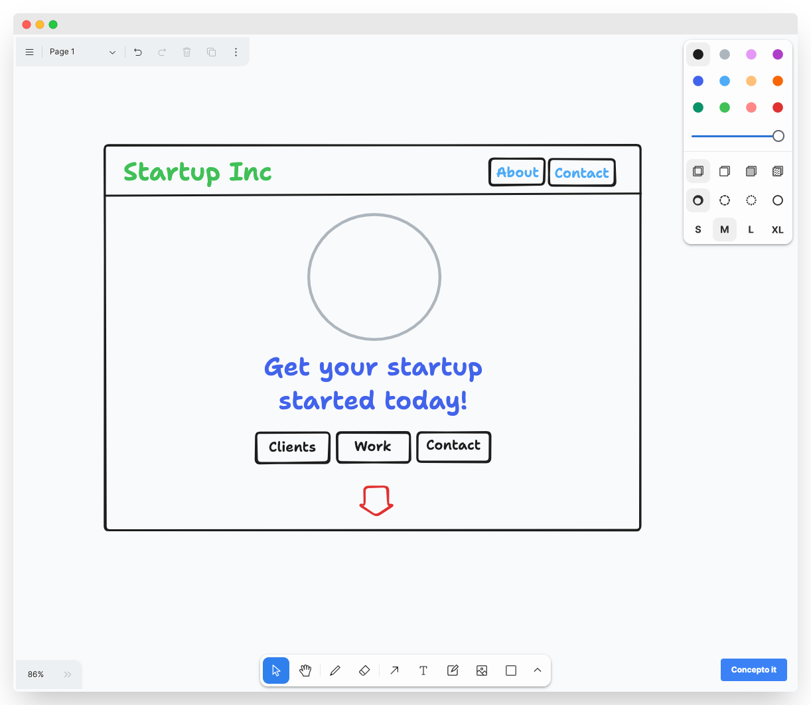

Concepto AI is an AI-powered platform that helps you to create your own websites using the power of your imagination and the power of OpenAI.

You can draw websites using `uidraw`, a web-first whieboaring tool that allows you to draw websites using a simple pen and paper interface, and then convert them into code using the power of OpenAI.

